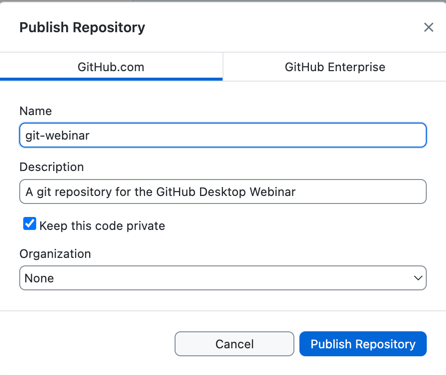
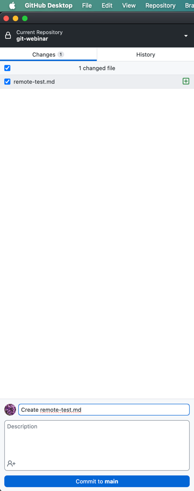
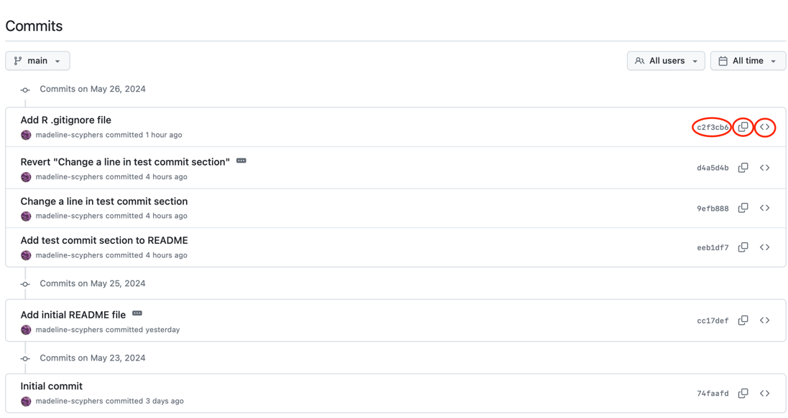

# 9: GitHub and Remote Repositories

Version control really comes into its own when we begin to collaborate with
other people.  We already have most of the machinery we need to do this; the
only thing missing is to copy changes from one repository to another.

Systems like Git allow us to move work between any two repositories.  In
practice, though, it's easiest to use one copy as a central hub, and to keep it
on the web rather than on someone's laptop.  Most programmers use hosting
services like [GitHub](https://github.com), [Bitbucket](https://bitbucket.org) or
[GitLab](https://gitlab.com/) to hold those main copies; we'll explore the pros
and cons of this in a [later episode](15-hosting).

Let's start by sharing the changes we've made to our current project with the
world. To this end we are going to create a *remote* repository that will be linked to our *local* repository.

## Table of Contents

1. [Create a Remote Repository](#create-a-remote-repository)
2. [Push Local Changes to a Remote](#push-local-changes-to-a-remote)
3. [GitHub GUI](#github-gui)

## Create a remote repository

GitHub Desktop lets us publish our local repository directly to GitHub. To do this, we just need to click on the "Publish repository" button in the GitHub Desktop interface.


We then fill in the repository name and description, and click whether we want the code to be private or not, and click the "Publish repository" button.
    
- if you keep the repo private, only you and collaborators you invite will be able to see the code.
- There may be other options such as what organization to put the repository in, but we can ignore those for now.



As soon as the repository is created, we can view it on GitHub by clicking the "View on GitHub" button.


Now whenever we "push" our commits to the remote repository, they will be copied to the repository on GitHub, backing up our work and making it easier for others to collaborate with us.

## Push local changes to a remote

Now that we have a remote repository, we can push our local changes to it. We don't have any changes yet, since we just pushed the whole repository, so let's create a new file and push that.

create a new file, you can call it `remote-test.md` and add some text to it.  Then save the file and commit the changes.

```
This is a test file for our remote repository commit.
```



We can now push this commit to the remote repository by clicking the "Push origin" button in GitHub Desktop. 


The number of commits to push will be display in the button.  Clicking the button will push the changes to the remote repository.

## GitHub GUI

We can also interact with our remote repository using the GitHub website. Browse to your `git-webinar` repository on GitHub. You can see the files in the repository, the commit history, and the README file. You can see any branches that have been created and published to the remote repository (our earlier branches are not published to the remote repository currently).

You can also see a number of tabs at the top of the repository page. These tabs allow you to view different aspects of the repository, such as the code, issues, pull requests, actions, and settings, and more. The default tabs usually are:

1. **Code**: This tab shows the files in the repository and allows you to browse the code.
2. **Issues**: This tab shows any issues that have been created for the repository. Issues are used to track bugs, feature requests, and other tasks.
3. **Pull requests**: This tab shows any pull requests that have been created for the repository. This is usually how multiple branches are merged together. This is the main way collaborators can contribute to a repository.
4. **Actions**: This tab shows any GitHub Actions that have been run for the repository. GitHub Actions are used to automate tasks like testing, building, and deploying code.
5. **Projects**: This tab shows any projects that have been created for the repository. Projects are used to track tasks and organize work. They can be used as a project management tool.
6. **Wiki**: This tab shows the wiki for the repository. The wiki is a place to document the project, including how to use it, how to contribute, and other information. You can also document your code through a number of other tools like Sphinx, Roxygen, or Javadoc.
7. **Security**: This tab shows any security alerts for the repository.
8. **Insights**: This tab shows insights into the repository, such as traffic, code frequency, and contributors.
9. **Settings**: This tab allows you to change the settings for the repository.


Underneath the Code button, find and click on the text that says "XX commits" (where "XX" is some number).


Hover over and click on the different icons to the right of each commit.
What information can you gather/explore from these buttons?



You will see that you can see that you can get to the commit details for any commit from here, copy the commit hash (a unique identifier for the commit), and view the repository at that commit.
