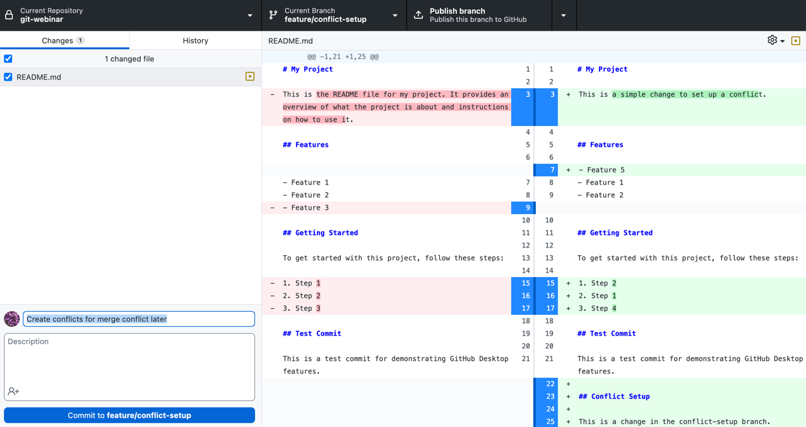
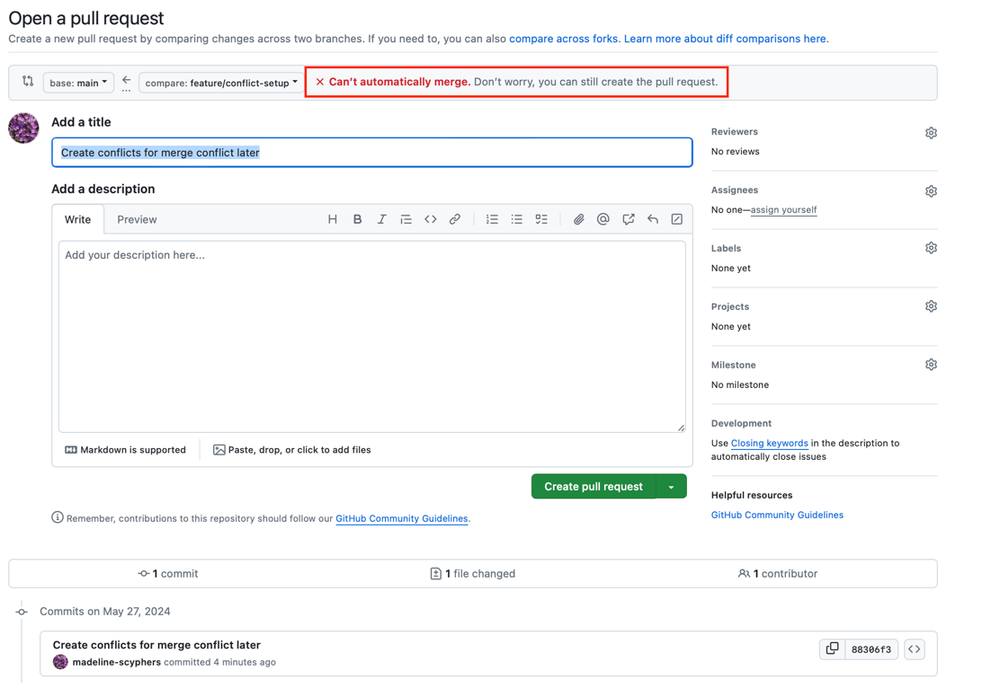
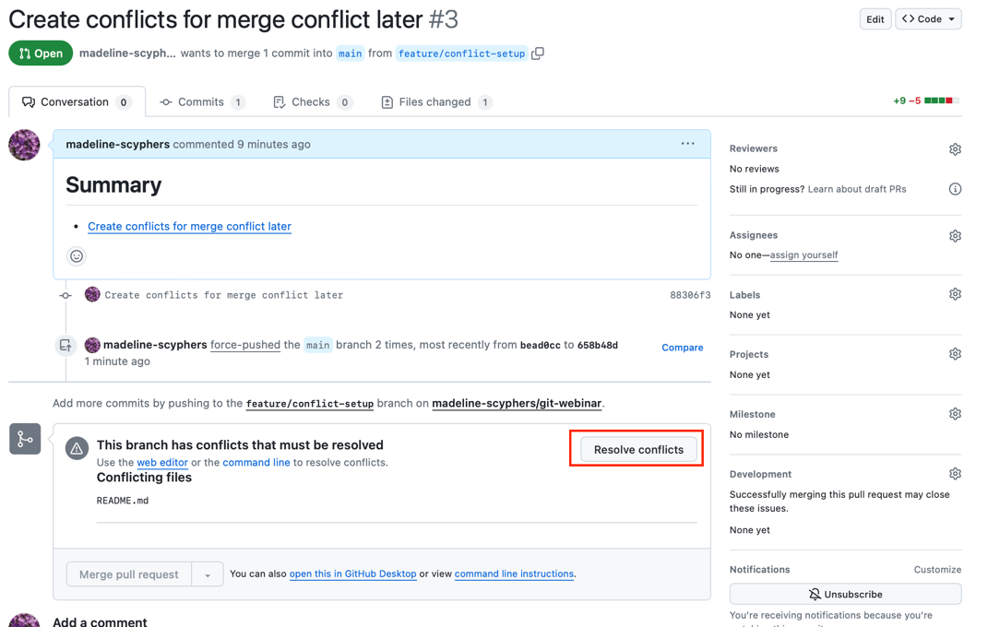
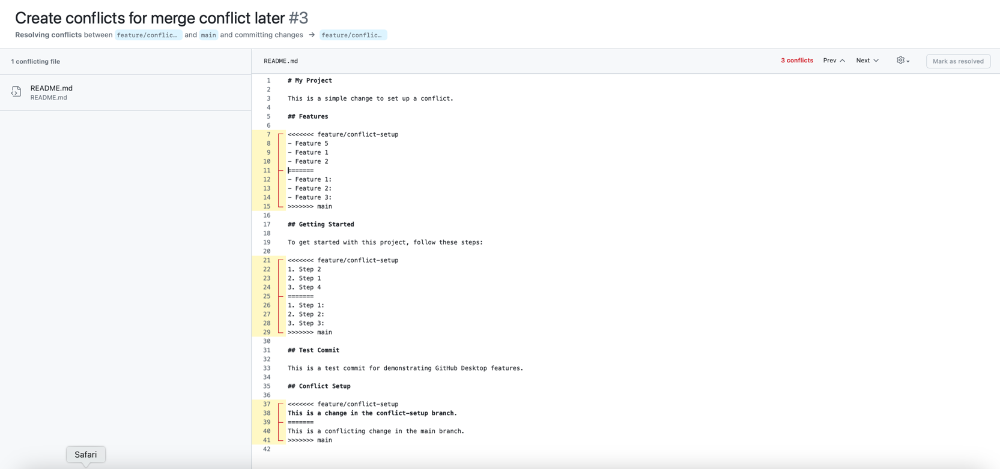
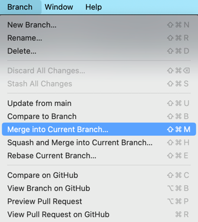
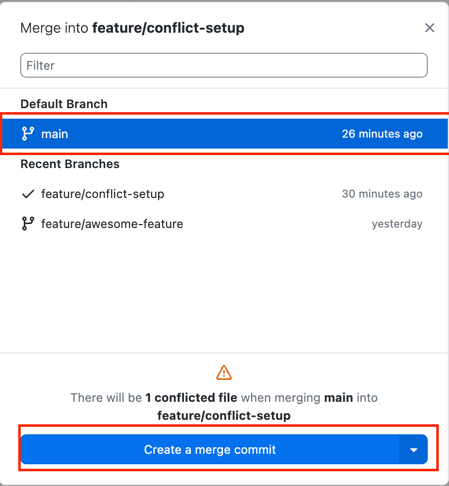
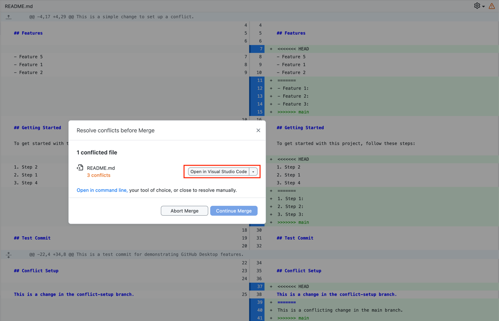
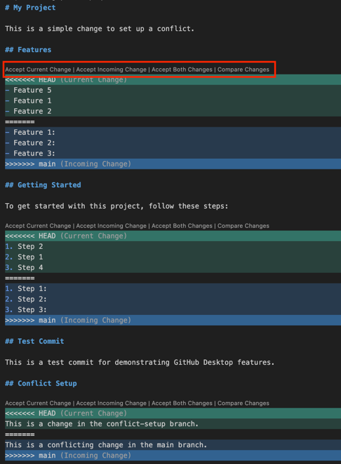
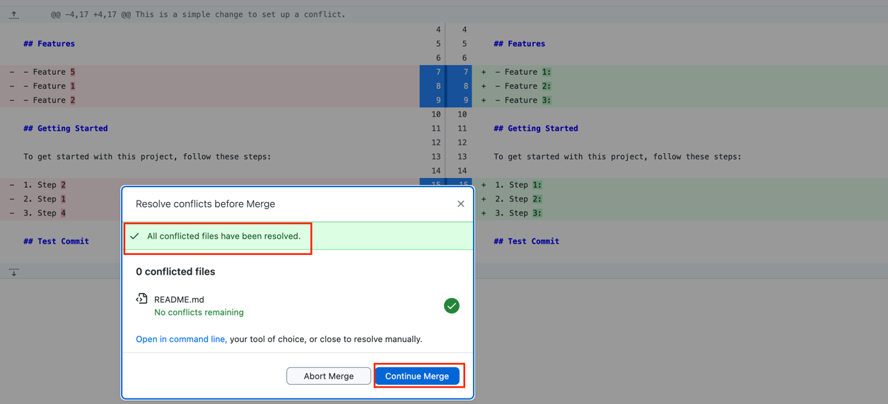
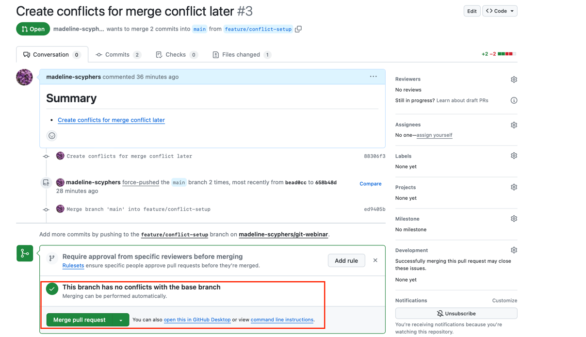

# Merge Conflicts

## What is a Merge Conflict?

A merge conflict in Git occurs when changes in different branches conflict with each other, and Git cannot automatically resolve these differences. When Git attempts to merge these changes, it encounters conflicting modifications that it cannot reconcile without human intervention.

#### Causes of Merge Conflicts
1. Concurrent Changes: Two or more branches have changes to the same lines in a file.
2. Deleting Files: One branch deletes a file that another branch has modified.
3. Different Modifications: The same part of a file has been modified differently in two branches.

## Table of Contents

1. [Creating a Merge Conflict](#creating-a-merge-conflict)
2. [Resolving a Merge Conflict](#resolving-a-merge-conflict)
3. [Approve and Merge](#approve-and-merge)
4. [Pulling Changes While Developing](#pulling-changes-while-developing)


## Creating a Merge Conflict

1. Create a new branch from the `main` branch (e.g., `feature/conflict-setup`).


2. Open the `README.md` file and add some text to it. You can also modify an existing section to create a conflict. Go wild with it if you want.

### Example Change to README.md:

```markdown
## Conflict Setup

This is a change in the conflict-setup branch.

```

3. Commit the changes and push the branch to GitHub.




4. Switch back to the `main` branch and make a conflicting change to the same section of the `README.md` file.

### Example Conflicting Change to README.md:

```markdown
## Conflict Setup

This is a conflicting change in the main branch.

```

5. Commit the changes and push to GitHub.

## Resolving a Merge Conflict

1. Create a PR for the `feature/conflict-setup` branch and try to merge it into the `main` branch. You will see a message indicating a merge conflict. 



A merge conflict isn't something to be afraid of. It's a natural part of collaborative development and working in a branching style of work, and resolving it helps ensure that the changes are integrated correctly.

### Understanding Merge Conflicts

A merge conflict occurs when changes from different branches conflict with each other and Git cannot automatically resolve the differences. This usually happens when the same lines of a file are changed in different branches.

There are several ways to resolve merge conflicts, we will go over 2 common methods:

### Resolving Conflicts in GitHub

You can resolve merge conflicts directly on GitHub using the conflict editor. Here's how:

1. Click on the `Resolve conflicts` button to open the conflict editor.



2. Manually resolve the conflicts by editing the conflicting files.



To resolve the conflict, you need to decide which changes to keep, which to remove, and how to combine them if necessary. The format follows this pattern:

``` 
<<<<<<< branch-coming-from
some change
=======
some conflicting change
>>>>>>> branch-going-to
```

And you pick which one you want (or a combination of both, or neighter) and remove the conflict markers.

So in this case below:

```
<<<<<<< feature/conflict-setup
This is a change in the conflict-setup branch.
=======
This is a conflicting change in the main branch.
>>>>>>> main
```

You could choose to keep the changes from `feature/conflict-setup` and leave it as:

``` 
This is a change in the conflict-setup branch.
```

Once you have resolved the conflict, you can mark it as resolved.


### Resolving Conflicts in Locally

Another way to resolve merge conflicts is to do it in your local repository. Generally people do this by merging the `main` branch (or whatever branch the PR is merging into) into their feature branch, resolving the conflicts, and then pushing the resolved changes back to the remote repository.

This sounds more complicated, but it can be easier to see the changes in your editor and resolve them there. Many Text Editors and IDEs have built-in tools to help you resolve conflicts in a faster and more efficient way than the GitHub interface.

Here's how you can resolve a conflict locally:

1. In GitHub Desktop, switch to the branch with the conflict (e.g., `feature/conflict-setup`).
2. Click on the `Branch` menu and select `Merge into current branch...`. Choose the branch you want to merge into the current branch (e.g., `main`).





3. GitHub Desktop will attempt to merge the changes. If there are conflicts, it will show a message indicating that the merge was unsuccessful due to conflicts. Click on the `Open in ...` (whatever you have set as your default text editor) button to open the conflicted file in your text editor.



Here is what vscode looks like when you have a conflict, with the conflicting changes highlighted. Notice also that it has buttons for accepting the changes from one side or the other, or both, and for marking the conflict as resolved. This makes it easy to resolve the conflicts without having to manually edit the file. Many other editors have similar features.



4. Resolve the conflicts in your text editor by editing the conflicting files. Save the changes once you have resolved the conflicts.
5. Return to GitHub Desktop. You should see that it says `"All conflicts have been resolved."` Allowing you to continue the merge process. Click `Continue merge`.



6. Push the changes to the remote repository by clicking the `Push origin` button.

## Approve and Merge

Either way you resolve the conflict, once the conflict is resolved, you can approve and merge the PR on GitHub. 



## Pulling Changes While Developing

When you are working on a feature branch, especially if it's a longer-lived branch, it's a good idea to pull changes from the main branch (or develop, or any other branch you want to keep up to date with) into your feature branch regularly. This helps prevent conflicts from building up and makes it easier to resolve them when they do occur, especially when working on a project with other people.

You do this by merging the main branch into your feature branch, resolving any conflicts that arise, and then continuing your work. This way, you can keep your feature branch up-to-date with the latest changes in the main branch and avoid conflicts when you merge your feature branch back into the main branch.

The process is the exact same as the steps outline in the [Resolve conflicts in Locally](#resolving-conflicts-in-locally) section, but you do it before you have a conflict, not after.
