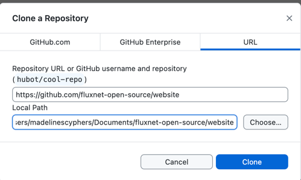

# 12: Cloning and Forking a Repository

In this chapter, you'll learn how to clone and fork repositories using GitHub Desktop and GitHub. Cloning a repository allows you to create a local copy of an existing repository, while forking creates a copy of someone else's repository under your own GitHub account, enabling you to make changes and propose them back to the original project.

## Table of Contents

1. [Cloning a Repository](#cloning-a-repository)
2. [Forking a Repository](#forking-a-repository)

## Cloning a Repository

Let's say you have deleted your local repository and want to "clone" (download) it from GitHub. This is a common scenario when you want to work on a project that is hosted on GitHub. Cloning a repository creates a local copy on your computer where you can make changes, commit them, and push them back to the remote repository.

Or, you might want to clone a repository from someone else to explore or experiment with their code. This is a common practice when you want to learn from others 

### Steps to Clone a Repository

1. In GitHub Desktop, click on the `File` menu and select `Clone repository...`.
2. In the `Clone a Repository` dialog, you can search for a repository by URL, GitHub username, or repository name.
3. Select the repository you want to clone.
  - here you can choose the url for this tutorial's repository: https://github.com/fluxnet-open-source/website
4. Choose a local path where you want to clone the repository on your computer, including the local repository name.
5. Click the `Clone` button.

4. **Work on Your Local Copy**: Once cloned, you can see the repository in your GitHub Desktop interface, open it in your file explorer or text editor, and start making changes.

## Forking a Repository

Now let's say instead of cloning your own repository or wanting to look at someone else's code, you either wanted to contribute to an open-source project or make a new project based on someone else's work. Forking a repository is the way to do this.

Forking a repository creates a copy of someone else's repository under your own GitHub account. This allows you to freely experiment with changes without affecting the original project. Once you have made your changes, you can propose them to the original repository by creating a pull request, though many projects fork repositories and never propose changes back to the original project for various reasons (the original project is no longer maintained so the fork is the new main project, the fork is trying out a new direction, etc.).

### Steps to Fork a Repository

1. **Go to the Repository on GitHub**: Navigate to the repository you want to fork on GitHub.
2. **Fork the Repository**:
   - Click the `Fork` button in the top-right corner of the repository page.
   - GitHub will create a copy of the repository under your GitHub account.

3. **Clone Your Forked Repository**:
   - After forking, you will be taken to your forked copy of the repository on GitHub. You can clone this repository to your local machine using the steps outlined in the previous section.

4. **Make Changes**: Work on your local copy of the forked repository. Commit and push your changes to your forked repository on GitHub.

5. **Create a Pull Request**:
   If you do create changes you want to propose back to the original repository, you can create a pull request by following the steps outlined in the [Pull Requests chapter](10-pull-requests.md). The only difference is that the base repository will be the original repository, and the compare repository will be your forked repository. 

### Syncing Changes from the Original Repository

If you forked a repository and the original repository has been updated, you can sync those changes with your forked repository. This is useful when you want to keep your forked repository up-to-date with the latest changes from the original project, or to minimize the conflicts when creating a pull request, this is the same reasons as outline in [Pulling Changes While Developing](11-merge-conflicts.md#pulling-changes-while-developing).

In GitHub, there is a `Sync Fork` button that will sync your forked repository with the original repository. This will fetch the changes from the original repository and merge them into your forked repository. Then you can pull them to your local repository.

