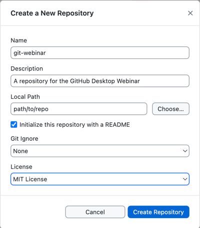
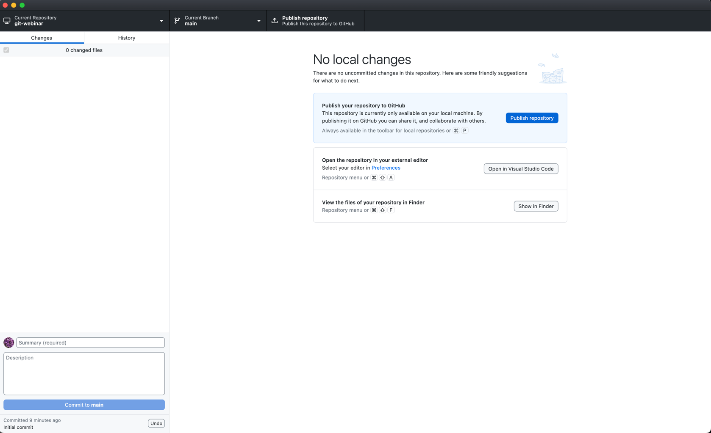

# How to Create and Initialize a Git Repository Locally Using GitHub Desktop

## Table of Contents

1. [Create a New Repository](#create-a-new-repository)
1. [Step 3: Fill in Repository Details](#fill-in-repository-details)
1. [Step 5: Verify the Repository](#verify-the-repository)

## Create a New Repository

1. Click on the `File` menu in the top left corner.
2. Select `New repository...` from the dropdown menu.

## Fill in Repository Details

1. **Name**: Enter a name for your repository.
2. **Description**: Optionally, enter a description for your repository.
3. **Local Path**: Choose a location on your computer where the repository will be created.
4. **Initialize this repository with a README**: Check this box to include a blank README file in the repository. If it is recommended to include a README file in a repository, as it provides information about the project and helps others understand its purpose, especially public repositories. But you can always add a README file later manually if you prefer.
  - Leave this box unchecked for this tutorial.
5. **Git Ignore**: Optionally, select a template for the `.gitignore` file to exclude certain files or directories from version control. Many programming languages will create certain files that you don't want to include in your version history, such as compiled binaries, temporary files, or virtual environments. Selecting a template will create a `.gitignore` file with common exclusions for that language.
6. **License**: Optionally, select a license for your repository. A license specifies how others can use, modify, and distribute your code. If you are unsure, you can choose to add a license later. You can also go to [choosealicense.com](https://choosealicense.com/) to learn more about different licenses and choose the one that best fits your needs.

Click the `Create repository` button. GitHub Desktop will create the repository in the specified location and initialize it with a README file (if selected).

## Verify the Repository

After creating the repository, you will be taken to the repository view in GitHub Desktop. You should see the current status of the repository, and the files that are part of the repository (which should be empty if you did not add any files yet).

